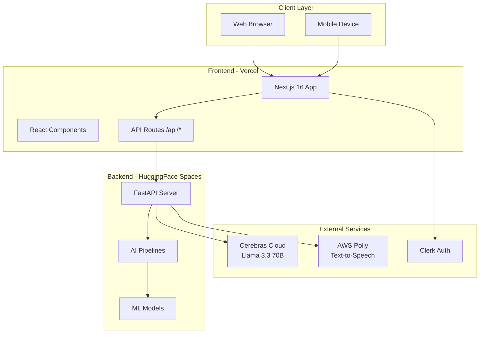
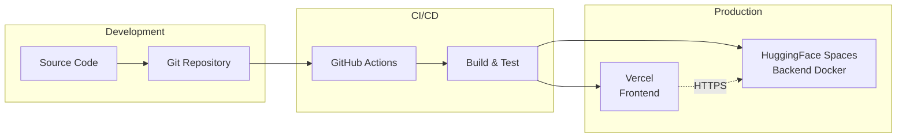
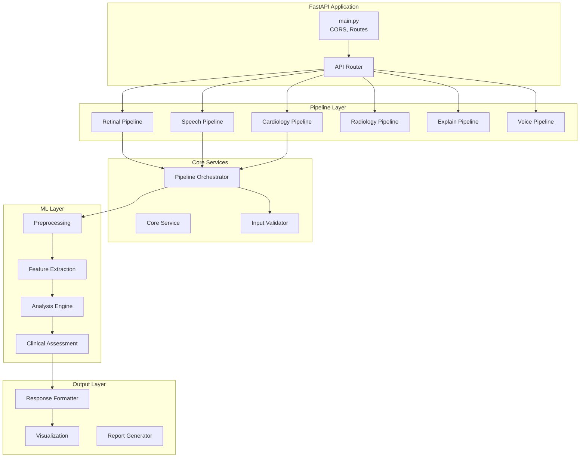
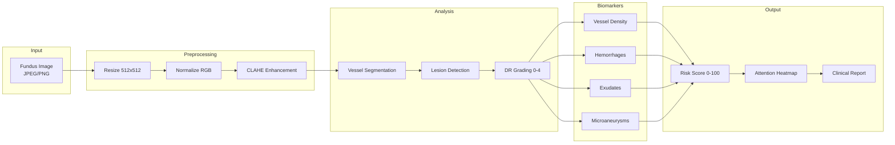
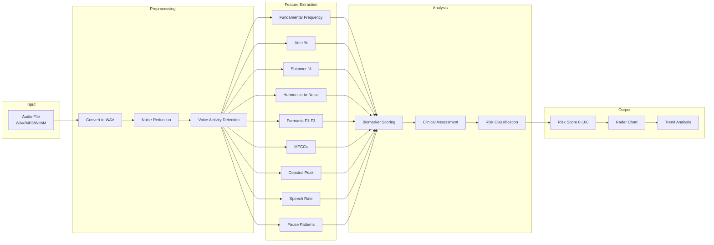
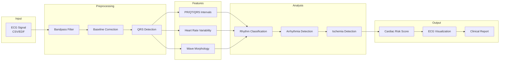
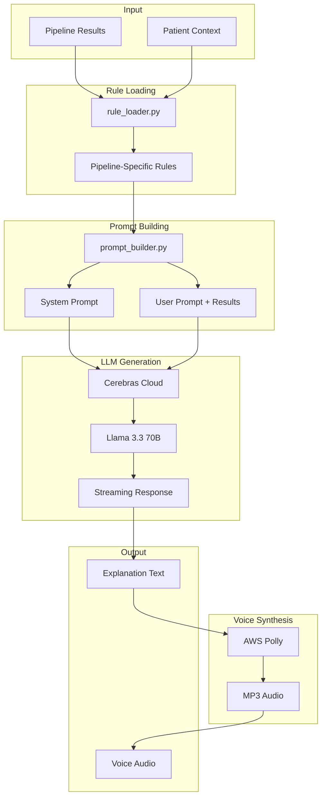
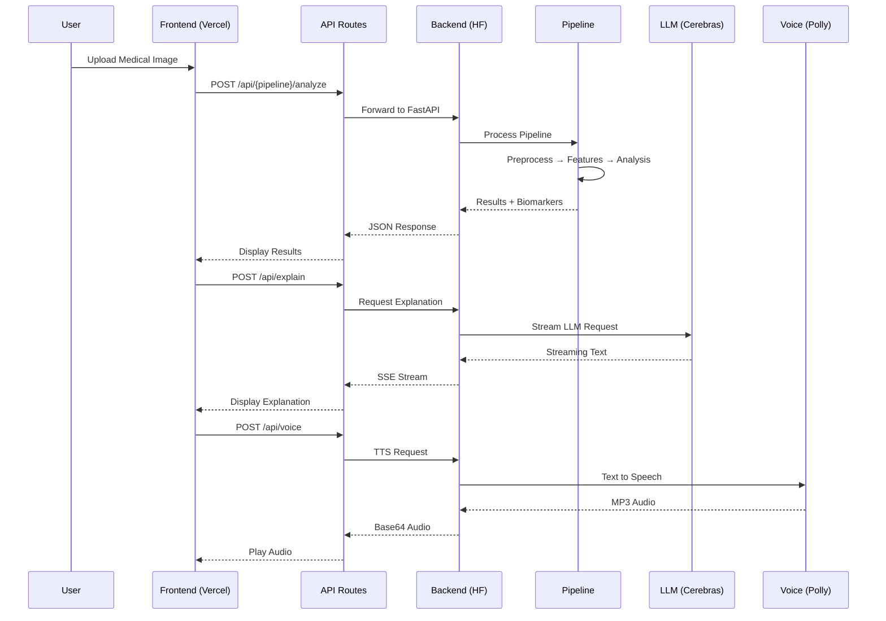

# MediLens Architecture

> Clinical-grade AI diagnostic platform architecture documentation

---

## 1. System Overview



---

## 2. Deployment Pipeline



**Deployment Flow:**
- Push to `main` triggers Vercel & HuggingFace builds
- Frontend: Next.js SSR on Vercel Edge
- Backend: Docker container on HuggingFace Spaces (port 7860)

---

## 3. Frontend Architecture

```mermaid
graph TB
    subgraph "Next.js App Router"
        Layout[Root Layout]
        Dashboard[Dashboard Layout]
        Pages[Page Components]
    end
    
    subgraph "Dashboard Pages"
        Retinal[/retinal]
        Speech[/speech]
        Cardio[/cardiology]
        Radio[/radiology]
        Derm[/dermatology]
        Motor[/motor]
        Cognitive[/cognitive]
        Multi[/multimodal]
        NRI[/nri-fusion]
    end
    
    subgraph "Shared Components"
        Sidebar[DashboardSidebar]
        Header[DashboardHeader]
        StatusBar[PipelineStatusBar]
        Chatbot[MedicalChatbot]
        Explain[ExplanationPanel]
    end
    
    subgraph "API Routes"
        Health[/api/health]
        Analyze[/api/*/analyze]
        ExplainAPI[/api/explain]
        Voice[/api/voice]
    end
    
    Layout --> Dashboard
    Dashboard --> Sidebar
    Dashboard --> Header
    Dashboard --> Pages
    Dashboard --> StatusBar
    Dashboard --> Chatbot
    
    Pages --> Retinal
    Pages --> Speech
    Pages --> Cardio
    Pages --> Radio
    Pages --> Derm
    Pages --> Motor
    Pages --> Cognitive
    Pages --> Multi
    Pages --> NRI
    
    Pages --> Explain
    Pages --> Analyze
    Explain --> ExplainAPI
    ExplainAPI --> Voice
```

**Frontend Stack:**
- Next.js 16 with App Router
- React 19, TypeScript
- Framer Motion animations
- Clerk authentication
- TailwindCSS styling

---

## 4. Backend Architecture



**Backend Stack:**
- FastAPI with async/await
- PyTorch, TensorFlow
- OpenCV, Parselmouth
- SQLAlchemy ORM

---

## 5. Pipeline Architecture (Standard)

Each pipeline follows this layered structure:

```mermaid
graph TB
    subgraph "Router Layer"
        Router[router.py<br/>/api/{pipeline}/*]
    end
    
    subgraph "Core Layer"
        Orchestrator[orchestrator.py]
        Service[service.py]
    end
    
    subgraph "Input Layer"
        Validator[validator.py]
        Parser[parser.py]
    end
    
    subgraph "Preprocessing Layer"
        Normalizer[normalizer.py]
        QualityGate[quality_gate.py]
    end
    
    subgraph "Features Layer"
        Extractor[extractor.py]
        Biomarkers[biomarkers.py]
    end
    
    subgraph "Analysis Layer"
        Analyzer[analyzer.py]
        Classifier[classifier.py]
    end
    
    subgraph "Clinical Layer"
        RiskScorer[risk_scorer.py]
        Recommendations[recommendations.py]
    end
    
    subgraph "Explanation Layer"
        Rules[rules.py]
        Templates[templates.py]
    end
    
    subgraph "Output Layer"
        Formatter[formatter.py]
        Visualization[visualization.py]
    end
    
    Router --> Orchestrator
    Orchestrator --> Validator
    Validator --> Normalizer
    Normalizer --> Extractor
    Extractor --> Analyzer
    Analyzer --> RiskScorer
    RiskScorer --> Rules
    Rules --> Formatter
```

---

## 6. Retinal Pipeline



---

## 7. Speech Pipeline



---

## 8. Cardiology Pipeline



---

## 9. AI Explanation Pipeline



---

## 10. Data Flow (End-to-End)



---

## 11. Security Architecture

```mermaid
graph TB
    subgraph "Authentication"
        Clerk[Clerk Auth]
        JWT[JWT Tokens]
        Session[Session Management]
    end
    
    subgraph "API Security"
        CORS[CORS Policy]
        RateLimit[Rate Limiting]
        Validation[Input Validation]
    end
    
    subgraph "Data Security"
        HTTPS[HTTPS/TLS]
        NoStore[No PHI Storage]
        Ephemeral[Ephemeral Processing]
    end
    
    subgraph "Compliance"
        HIPAA[HIPAA Guidelines]
        Privacy[Privacy First]
        Audit[Audit Logging]
    end
    
    Clerk --> JWT --> Session
    CORS --> RateLimit --> Validation
    HTTPS --> NoStore --> Ephemeral
    HIPAA --> Privacy --> Audit
```



---

## 12. Folder Structure

```
NeuraLens/
├── frontend/                 # Next.js Application
│   ├── src/
│   │   ├── app/             # App Router Pages
│   │   │   ├── dashboard/   # Dashboard Pages
│   │   │   └── api/         # API Routes
│   │   ├── components/      # Shared Components
│   │   └── data/            # Static Data
│   └── public/              # Static Assets
│
├── backend/                  # FastAPI Application
│   ├── app/
│   │   ├── main.py          # Entry Point
│   │   ├── routers/         # API Routers
│   │   └── pipelines/       # AI Pipelines
│   │       ├── retinal/     # Retinal Analysis
│   │       ├── speech/      # Speech Analysis
│   │       ├── cardiology/  # Cardiology Analysis
│   │       ├── radiology/   # Radiology Analysis
│   │       ├── explain/     # AI Explanations
│   │       └── voice/       # Voice Synthesis
│   └── Dockerfile           # Docker Config
│
└── docs/                     # Documentation
```

---

## Key Design Decisions

| Decision | Rationale |
|----------|-----------|
| Next.js App Router | Server components, streaming, edge runtime |
| FastAPI | Async support, auto-docs, type safety |
| Layered Pipelines | Separation of concerns, testability |
| Cerebras Llama 3.3 | Fast inference, medical knowledge |
| AWS Polly | Reliable TTS, natural voices |
| Docker on HF Spaces | Free hosting, GPU support |
| Vercel Edge | Global CDN, serverless |

---

*Architecture Version: 1.0 | Last Updated: January 2026*
