# MediLens Architecture

> Clinical-grade AI diagnostic platform architecture documentation

---

## 1. System Overview

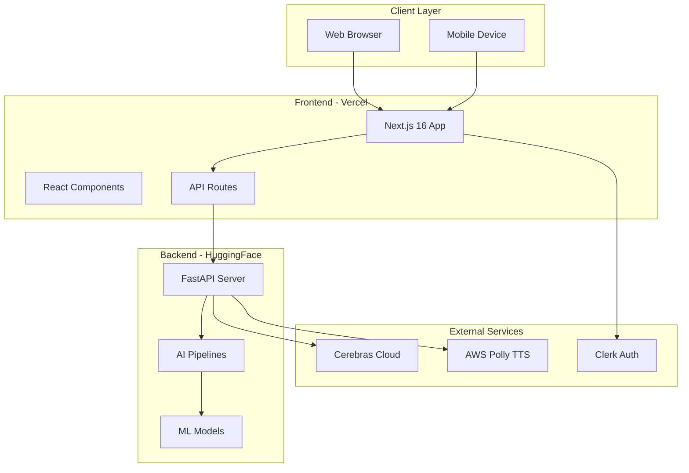

---

## 2. Deployment Pipeline

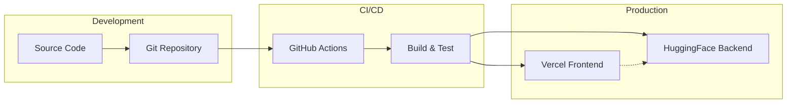

**Deployment Flow:**
- Push to `main` triggers Vercel & HuggingFace builds
- Frontend: Next.js SSR on Vercel Edge
- Backend: Docker container on HuggingFace Spaces (port 7860)

---

## 3. Frontend Architecture

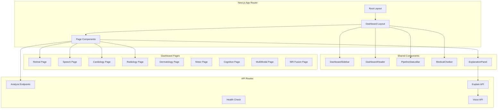

**Frontend Stack:**
- Next.js 16 with App Router
- React 19, TypeScript
- Framer Motion animations
- Clerk authentication
- TailwindCSS styling

---

## 4. Backend Architecture

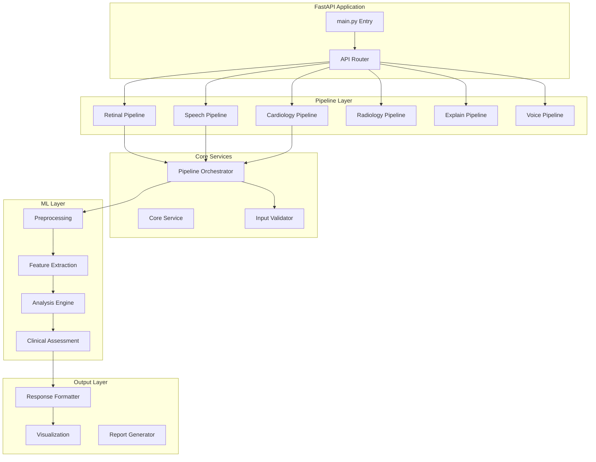

**Backend Stack:**
- FastAPI with async/await
- PyTorch, TensorFlow
- OpenCV, Parselmouth
- SQLAlchemy ORM

---

## 5. Pipeline Architecture (Standard)

Each pipeline follows this layered structure:

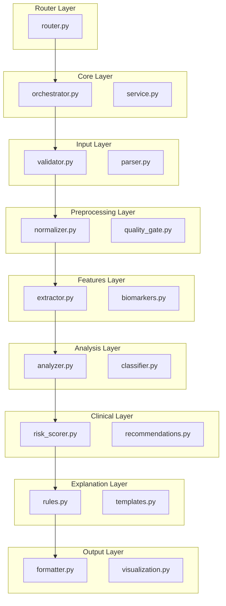

---

## 6. Retinal Pipeline

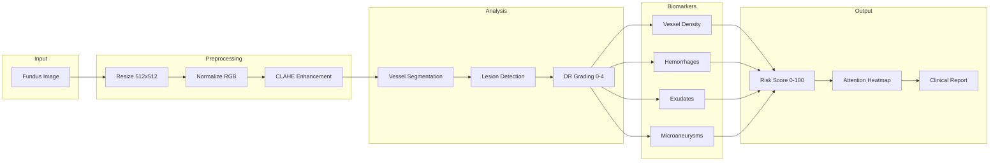

---

## 7. Speech Pipeline

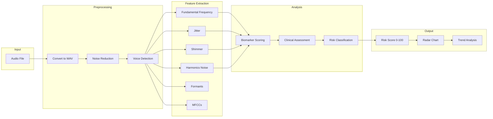

---

## 8. Cardiology Pipeline

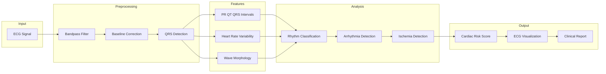

---

## 9. AI Explanation Pipeline

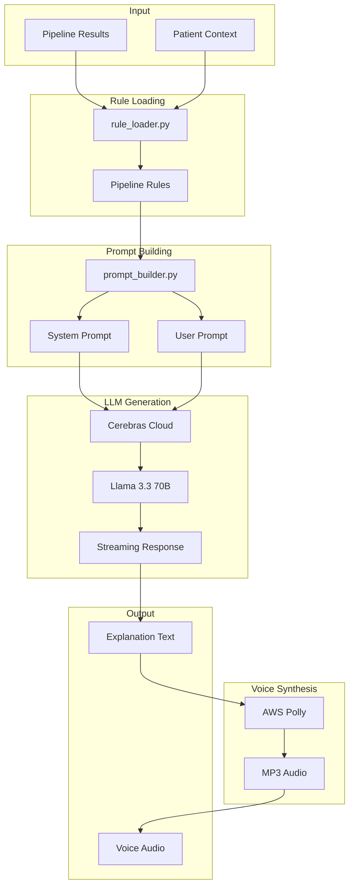

---

## 10. Data Flow (End-to-End)

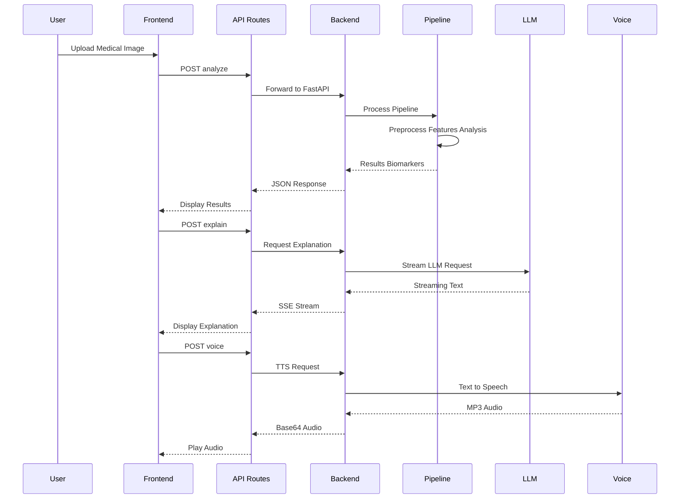

---

## 11. Security Architecture

```mermaid
graph TB
    subgraph Auth["Authentication"]
        ClerkAuth["Clerk Auth"]
        JWT["JWT Tokens"]
        Session["Session Mgmt"]
    end
    
    subgraph APISec["API Security"]
        CORS["CORS Policy"]
        RateLimit["Rate Limiting"]
        Validation["Input Validation"]
    end
    
    subgraph DataSec["Data Security"]
        HTTPS["HTTPS TLS"]
        NoStore["No PHI Storage"]
        Ephemeral["Ephemeral Processing"]
    end
    
    subgraph Compliance["Compliance"]
        HIPAA["HIPAA Guidelines"]
        Privacy["Privacy First"]
        Audit["Audit Logging"]
    end
    
    ClerkAuth --> JWT --> Session
    CORS --> RateLimit --> Validation
    HTTPS --> NoStore --> Ephemeral
    HIPAA --> Privacy --> Audit
```

---

## 12. Folder Structure

```
NeuraLens/
├── frontend/                 # Next.js Application
│   ├── src/
│   │   ├── app/             # App Router Pages
│   │   │   ├── dashboard/   # Dashboard Pages
│   │   │   └── api/         # API Routes
│   │   ├── components/      # Shared Components
│   │   └── data/            # Static Data
│   └── public/              # Static Assets
│
├── backend/                  # FastAPI Application
│   ├── app/
│   │   ├── main.py          # Entry Point
│   │   ├── routers/         # API Routers
│   │   └── pipelines/       # AI Pipelines
│   │       ├── retinal/     # Retinal Analysis
│   │       ├── speech/      # Speech Analysis
│   │       ├── cardiology/  # Cardiology Analysis
│   │       ├── radiology/   # Radiology Analysis
│   │       ├── explain/     # AI Explanations
│   │       └── voice/       # Voice Synthesis
│   └── Dockerfile           # Docker Config
│
└── docs/                     # Documentation
```

---

## Key Design Decisions

| Decision | Rationale |
|----------|-----------|
| Next.js App Router | Server components, streaming, edge runtime |
| FastAPI | Async support, auto-docs, type safety |
| Layered Pipelines | Separation of concerns, testability |
| Cerebras Llama 3.3 | Fast inference, medical knowledge |
| AWS Polly | Reliable TTS, natural voices |
| Docker on HF Spaces | Free hosting, GPU support |
| Vercel Edge | Global CDN, serverless |

---

*Architecture Version: 1.0 | Last Updated: January 2026*
