# NeuraLens: Visual Workflow Documentation

## Table of Contents

1. [System Architecture](#system-architecture)
2. [API Assessment Flow](#api-assessment-flow)
3. [Multi-Modal Data Processing](#multi-modal-data-processing)
4. [User Interface Workflows](#user-interface-workflows)
5. [Database Schema and Data Flow](#database-schema-and-data-flow)
6. [Authentication and Security](#authentication-and-security)
7. [ML Model Processing Pipelines](#ml-model-processing-pipelines)
8. [Error Handling and Validation](#error-handling-and-validation)
9. [Deployment and CI/CD Pipeline](#deployment-and-cicd-pipeline)

---

## System Architecture

### Overall Platform Architecture

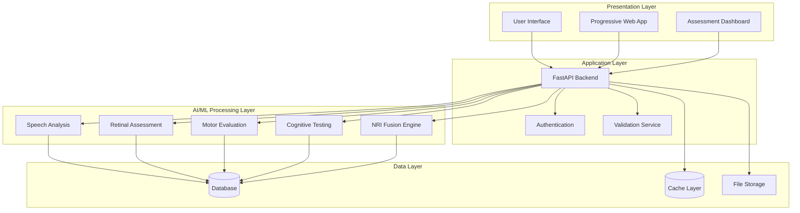
```mermaid
graph TB
    subgraph "Presentation Layer"
        UI[User Interface]
        PWA[Progressive Web App]
        DASH[Assessment Dashboard]
    end

    subgraph "Application Layer"
        API[FastAPI Backend]
        AUTH[Authentication]
        VALID[Validation Service]
    end

    subgraph "AI/ML Processing Layer"
        SPEECH[Speech Analysis]
        RETINAL[Retinal Assessment]
        MOTOR[Motor Evaluation]
        COGNITIVE[Cognitive Testing]
        NRI[NRI Fusion Engine]
    end

    subgraph "Data Layer"
        DB[(Database)]
        CACHE[(Cache Layer)]
        FILES[File Storage]
    end

    UI --> API
    PWA --> API
    DASH --> API

    API --> AUTH
    API --> VALID
    API --> SPEECH
    API --> RETINAL
    API --> MOTOR
    API --> COGNITIVE
    API --> NRI

    SPEECH --> DB
    RETINAL --> DB
    MOTOR --> DB
    COGNITIVE --> DB
    NRI --> DB

    API --> CACHE
    API --> FILES
```

---

## API Assessment Flow

### Complete Assessment Workflow

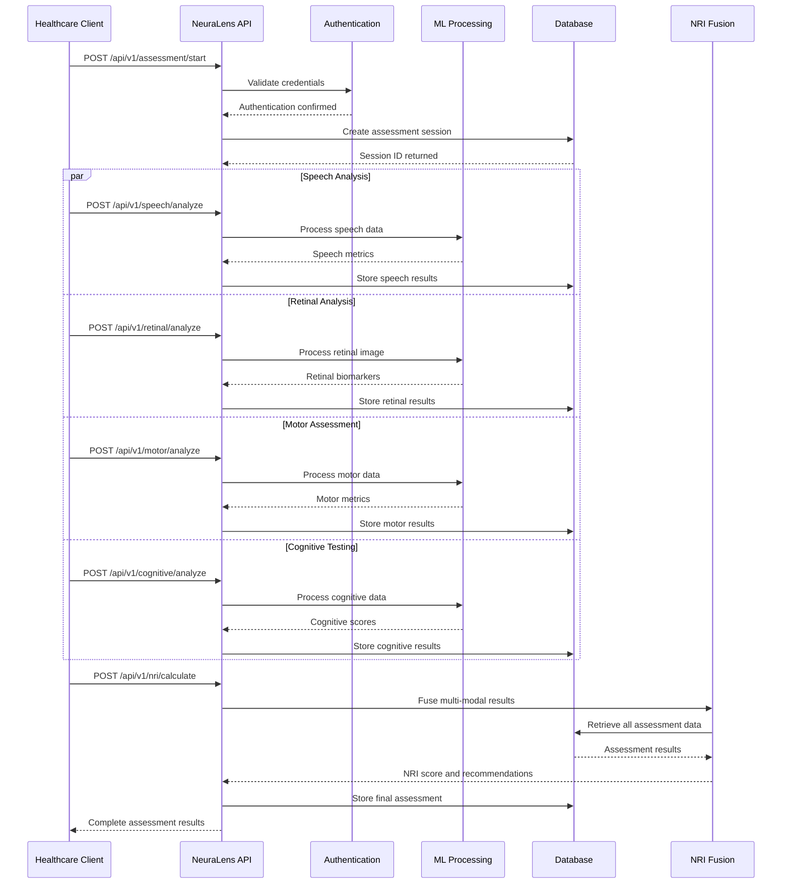
```mermaid
sequenceDiagram
    participant Client as Healthcare Client
    participant API as NeuraLens API
    participant Auth as Authentication
    participant ML as ML Processing
    participant DB as Database
    participant NRI as NRI Fusion

    Client->>API: POST /api/v1/assessment/start
    API->>Auth: Validate credentials
    Auth-->>API: Authentication confirmed

    API->>DB: Create assessment session
    DB-->>API: Session ID returned

    par Speech Analysis
        Client->>API: POST /api/v1/speech/analyze
        API->>ML: Process speech data
        ML-->>API: Speech metrics
        API->>DB: Store speech results
    and Retinal Analysis
        Client->>API: POST /api/v1/retinal/analyze
        API->>ML: Process retinal image
        ML-->>API: Retinal biomarkers
        API->>DB: Store retinal results
    and Motor Assessment
        Client->>API: POST /api/v1/motor/analyze
        API->>ML: Process motor data
        ML-->>API: Motor metrics
        API->>DB: Store motor results
    and Cognitive Testing
        Client->>API: POST /api/v1/cognitive/analyze
        API->>ML: Process cognitive data
        ML-->>API: Cognitive scores
        API->>DB: Store cognitive results
    end

    Client->>API: POST /api/v1/nri/calculate
    API->>NRI: Fuse multi-modal results
    NRI->>DB: Retrieve all assessment data
    DB-->>NRI: Assessment results
    NRI-->>API: NRI score and recommendations
    API->>DB: Store final assessment
    API-->>Client: Complete assessment results
```

---

## Multi-Modal Data Processing

### Data Processing Pipeline

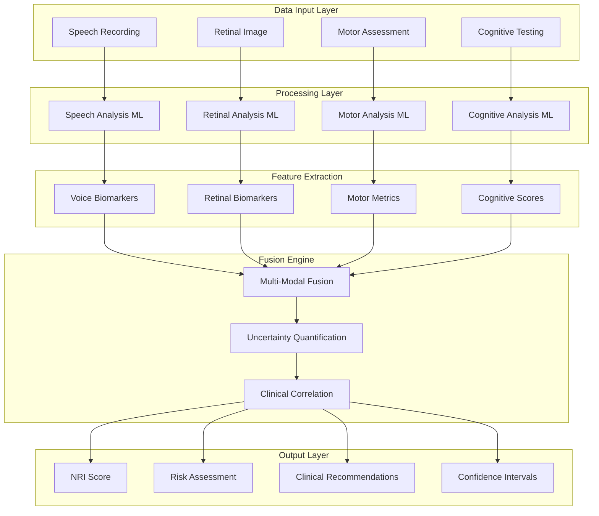
```mermaid
flowchart TD
    subgraph "Data Input Layer"
        A[Speech Recording]
        B[Retinal Image]
        C[Motor Assessment]
        D[Cognitive Testing]
    end

    subgraph "Processing Layer"
        E[Speech Analysis ML]
        F[Retinal Analysis ML]
        G[Motor Analysis ML]
        H[Cognitive Analysis ML]
    end

    subgraph "Feature Extraction"
        I[Voice Biomarkers]
        J[Retinal Biomarkers]
        K[Motor Metrics]
        L[Cognitive Scores]
    end

    subgraph "Fusion Engine"
        M[Multi-Modal Fusion]
        N[Uncertainty Quantification]
        O[Clinical Correlation]
    end

    subgraph "Output Layer"
        P[NRI Score]
        Q[Risk Assessment]
        R[Clinical Recommendations]
        S[Confidence Intervals]
    end

    A --> E
    B --> F
    C --> G
    D --> H

    E --> I
    F --> J
    G --> K
    H --> L

    I --> M
    J --> M
    K --> M
    L --> M

    M --> N
    N --> O

    O --> P
    O --> Q
    O --> R
    O --> S
```

---

## User Interface Workflows

### Dashboard Navigation Flow

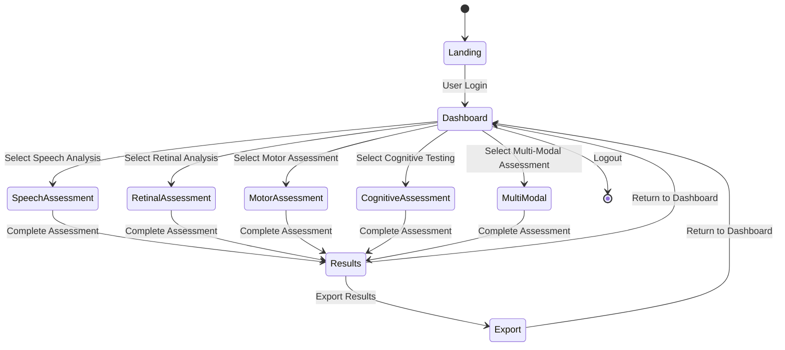
```mermaid
stateDiagram-v2
    [*] --> Landing
    Landing --> Dashboard: User Login
    Dashboard --> SpeechAssessment: Select Speech Analysis
    Dashboard --> RetinalAssessment: Select Retinal Analysis
    Dashboard --> MotorAssessment: Select Motor Assessment
    Dashboard --> CognitiveAssessment: Select Cognitive Testing
    Dashboard --> MultiModal: Select Multi-Modal Assessment

    SpeechAssessment --> Results: Complete Assessment
    RetinalAssessment --> Results: Complete Assessment
    MotorAssessment --> Results: Complete Assessment
    CognitiveAssessment --> Results: Complete Assessment
    MultiModal --> Results: Complete Assessment

    Results --> Dashboard: Return to Dashboard
    Results --> Export: Export Results
    Export --> Dashboard: Return to Dashboard

    Dashboard --> [*]: Logout
```

### Assessment Component Interaction

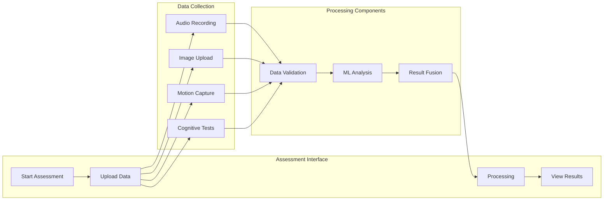
```mermaid
graph LR
    subgraph "Assessment Interface"
        START[Start Assessment]
        UPLOAD[Upload Data]
        PROCESS[Processing]
        RESULTS[View Results]
    end

    subgraph "Data Collection"
        AUDIO[Audio Recording]
        IMAGE[Image Upload]
        MOTION[Motion Capture]
        COGNITIVE[Cognitive Tests]
    end

    subgraph "Processing Components"
        VALIDATE[Data Validation]
        ANALYZE[ML Analysis]
        FUSION[Result Fusion]
    end

    START --> UPLOAD
    UPLOAD --> AUDIO
    UPLOAD --> IMAGE
    UPLOAD --> MOTION
    UPLOAD --> COGNITIVE

    AUDIO --> VALIDATE
    IMAGE --> VALIDATE
    MOTION --> VALIDATE
    COGNITIVE --> VALIDATE

    VALIDATE --> ANALYZE
    ANALYZE --> FUSION
    FUSION --> PROCESS
    PROCESS --> RESULTS
```

---

## Database Schema and Data Flow

### Database Entity Relationships

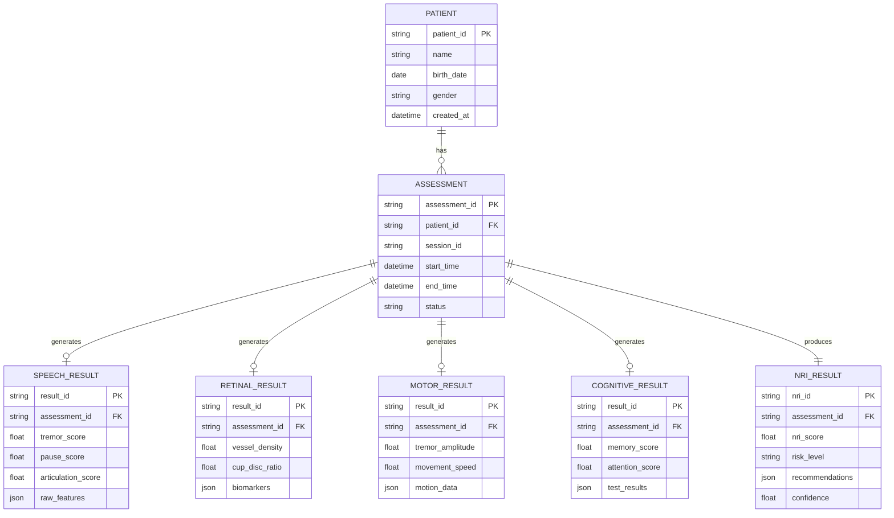
```mermaid
erDiagram
    PATIENT {
        string patient_id PK
        string name
        date birth_date
        string gender
        datetime created_at
    }

    ASSESSMENT {
        string assessment_id PK
        string patient_id FK
        string session_id
        datetime start_time
        datetime end_time
        string status
    }

    SPEECH_RESULT {
        string result_id PK
        string assessment_id FK
        float tremor_score
        float pause_score
        float articulation_score
        json raw_features
    }

    RETINAL_RESULT {
        string result_id PK
        string assessment_id FK
        float vessel_density
        float cup_disc_ratio
        json biomarkers
    }

    MOTOR_RESULT {
        string result_id PK
        string assessment_id FK
        float tremor_amplitude
        float movement_speed
        json motion_data
    }

    COGNITIVE_RESULT {
        string result_id PK
        string assessment_id FK
        float memory_score
        float attention_score
        json test_results
    }

    NRI_RESULT {
        string nri_id PK
        string assessment_id FK
        float nri_score
        string risk_level
        json recommendations
        float confidence
    }

    PATIENT ||--o{ ASSESSMENT : has
    ASSESSMENT ||--o| SPEECH_RESULT : generates
    ASSESSMENT ||--o| RETINAL_RESULT : generates
    ASSESSMENT ||--o| MOTOR_RESULT : generates
    ASSESSMENT ||--o| COGNITIVE_RESULT : generates
    ASSESSMENT ||--|| NRI_RESULT : produces
```

### Data Flow Architecture

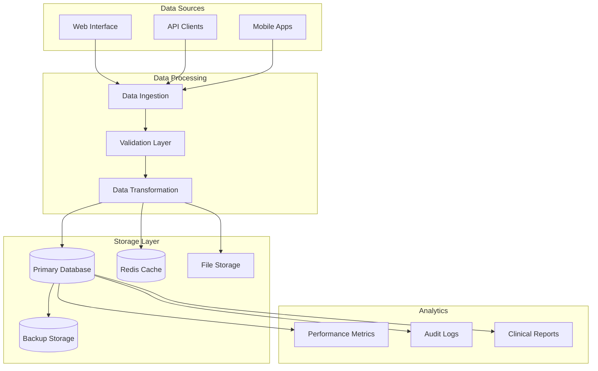
```mermaid
graph TD
    subgraph "Data Sources"
        WEB[Web Interface]
        API[API Clients]
        MOBILE[Mobile Apps]
    end

    subgraph "Data Processing"
        INGEST[Data Ingestion]
        VALIDATE[Validation Layer]
        TRANSFORM[Data Transformation]
    end

    subgraph "Storage Layer"
        PRIMARY[(Primary Database)]
        CACHE[(Redis Cache)]
        FILES[File Storage]
        BACKUP[(Backup Storage)]
    end

    subgraph "Analytics"
        METRICS[Performance Metrics]
        AUDIT[Audit Logs]
        REPORTS[Clinical Reports]
    end

    WEB --> INGEST
    API --> INGEST
    MOBILE --> INGEST

    INGEST --> VALIDATE
    VALIDATE --> TRANSFORM

    TRANSFORM --> PRIMARY
    TRANSFORM --> CACHE
    TRANSFORM --> FILES

    PRIMARY --> BACKUP
    PRIMARY --> METRICS
    PRIMARY --> AUDIT
    PRIMARY --> REPORTS
```

---

## Authentication and Security

### Authentication Workflow

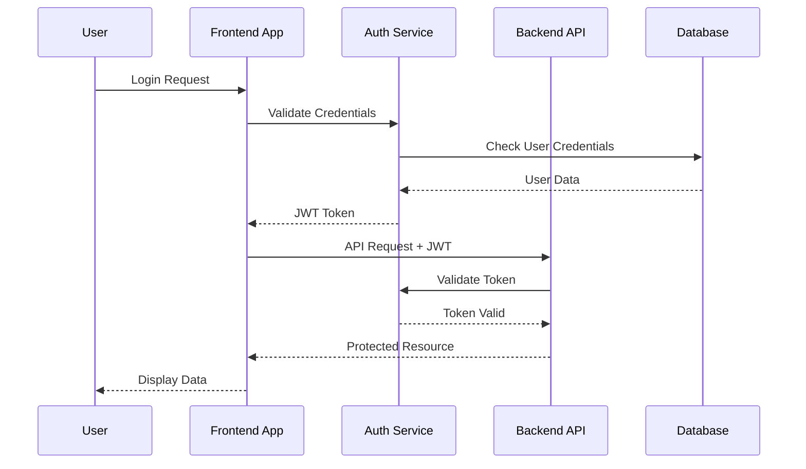
```mermaid
sequenceDiagram
    participant User as User
    participant Frontend as Frontend App
    participant Auth as Auth Service
    participant API as Backend API
    participant DB as Database

    User->>Frontend: Login Request
    Frontend->>Auth: Validate Credentials
    Auth->>DB: Check User Credentials
    DB-->>Auth: User Data
    Auth-->>Frontend: JWT Token
    Frontend->>API: API Request + JWT
    API->>Auth: Validate Token
    Auth-->>API: Token Valid
    API-->>Frontend: Protected Resource
    Frontend-->>User: Display Data
```

### Security Architecture

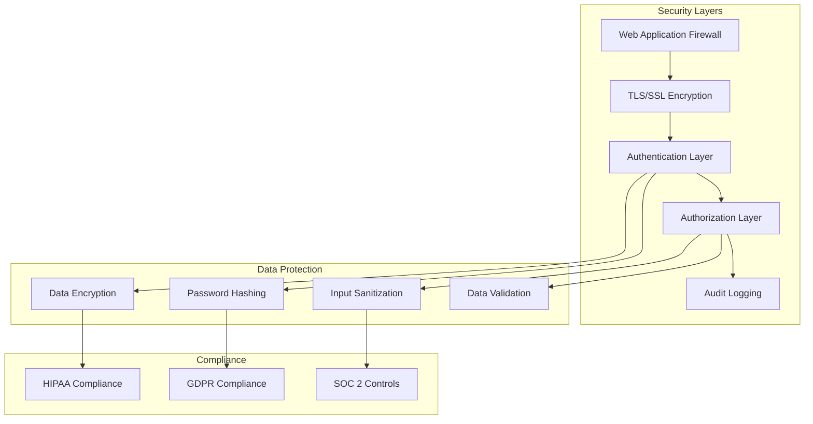
```mermaid
graph TB
    subgraph "Security Layers"
        WAF[Web Application Firewall]
        TLS[TLS/SSL Encryption]
        AUTH[Authentication Layer]
        AUTHZ[Authorization Layer]
        AUDIT[Audit Logging]
    end

    subgraph "Data Protection"
        ENCRYPT[Data Encryption]
        HASH[Password Hashing]
        SANITIZE[Input Sanitization]
        VALIDATE[Data Validation]
    end

    subgraph "Compliance"
        HIPAA[HIPAA Compliance]
        GDPR[GDPR Compliance]
        SOC[SOC 2 Controls]
    end

    WAF --> TLS
    TLS --> AUTH
    AUTH --> AUTHZ
    AUTHZ --> AUDIT

    AUTH --> ENCRYPT
    AUTH --> HASH
    AUTHZ --> SANITIZE
    AUTHZ --> VALIDATE

    ENCRYPT --> HIPAA
    HASH --> GDPR
    SANITIZE --> SOC
```

---

## ML Model Processing Pipelines

### Speech Analysis Pipeline

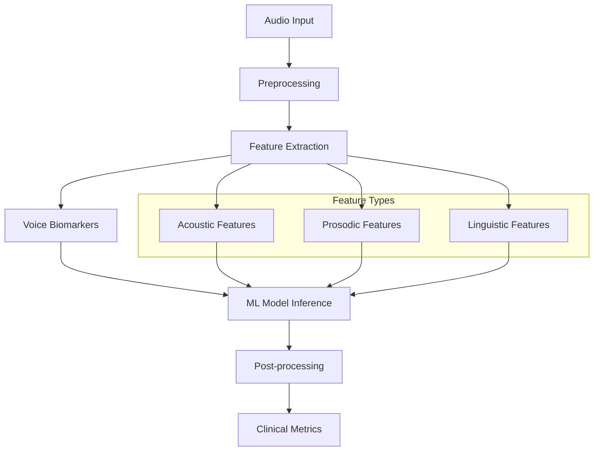
```mermaid
flowchart TD
    A[Audio Input] --> B[Preprocessing]
    B --> C[Feature Extraction]
    C --> D[Voice Biomarkers]
    D --> E[ML Model Inference]
    E --> F[Post-processing]
    F --> G[Clinical Metrics]

    subgraph "Feature Types"
        H[Acoustic Features]
        I[Prosodic Features]
        J[Linguistic Features]
    end

    C --> H
    C --> I
    C --> J

    H --> E
    I --> E
    J --> E
```

### Retinal Analysis Pipeline

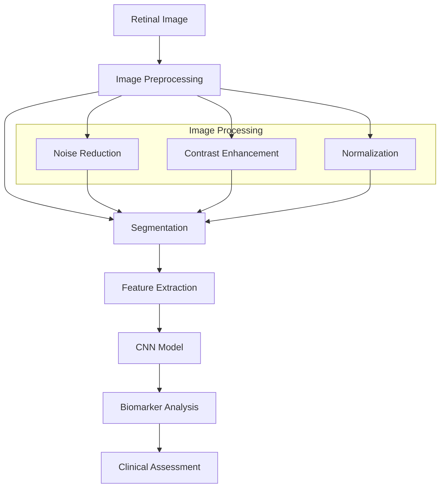
```mermaid
flowchart TD
    A[Retinal Image] --> B[Image Preprocessing]
    B --> C[Segmentation]
    C --> D[Feature Extraction]
    D --> E[CNN Model]
    E --> F[Biomarker Analysis]
    F --> G[Clinical Assessment]

    subgraph "Image Processing"
        H[Noise Reduction]
        I[Contrast Enhancement]
        J[Normalization]
    end

    B --> H
    B --> I
    B --> J

    H --> C
    I --> C
    J --> C
```

### Motor Assessment Pipeline

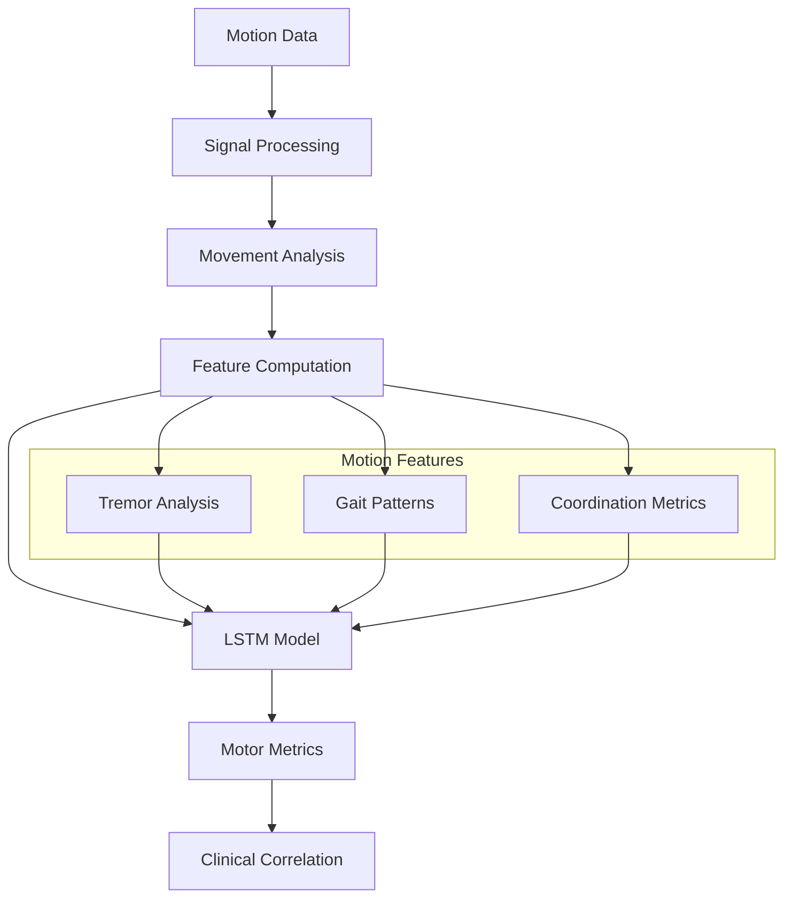
```mermaid
flowchart TD
    A[Motion Data] --> B[Signal Processing]
    B --> C[Movement Analysis]
    C --> D[Feature Computation]
    D --> E[LSTM Model]
    E --> F[Motor Metrics]
    F --> G[Clinical Correlation]

    subgraph "Motion Features"
        H[Tremor Analysis]
        I[Gait Patterns]
        J[Coordination Metrics]
    end

    D --> H
    D --> I
    D --> J

    H --> E
    I --> E
    J --> E
```

### Cognitive Testing Pipeline

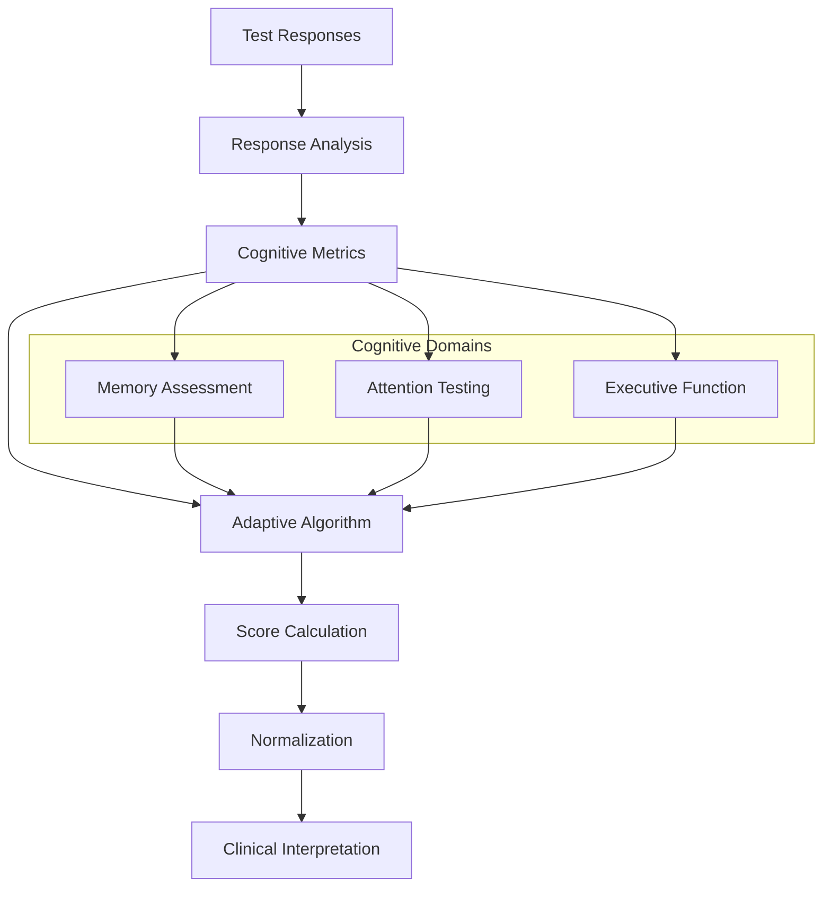
```mermaid
flowchart TD
    A[Test Responses] --> B[Response Analysis]
    B --> C[Cognitive Metrics]
    C --> D[Adaptive Algorithm]
    D --> E[Score Calculation]
    E --> F[Normalization]
    F --> G[Clinical Interpretation]

    subgraph "Cognitive Domains"
        H[Memory Assessment]
        I[Attention Testing]
        J[Executive Function]
    end

    C --> H
    C --> I
    C --> J

    H --> D
    I --> D
    J --> D
```

### NRI Fusion Engine

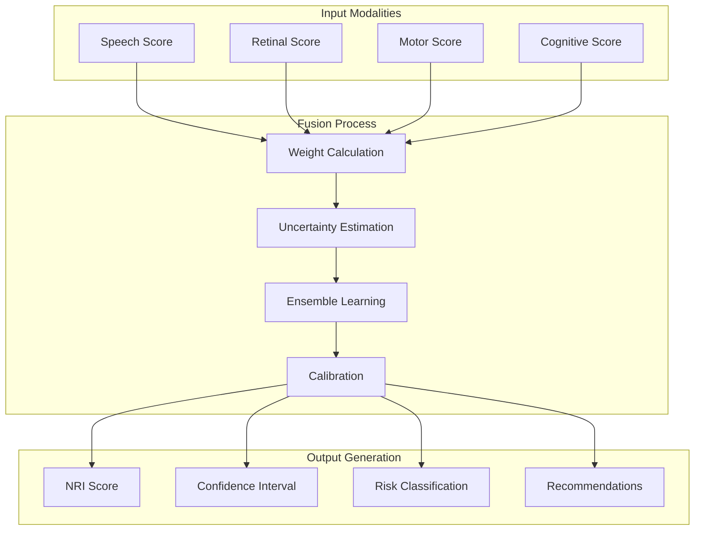
```mermaid
flowchart TD
    subgraph "Input Modalities"
        A[Speech Score]
        B[Retinal Score]
        C[Motor Score]
        D[Cognitive Score]
    end

    subgraph "Fusion Process"
        E[Weight Calculation]
        F[Uncertainty Estimation]
        G[Ensemble Learning]
        H[Calibration]
    end

    subgraph "Output Generation"
        I[NRI Score]
        J[Confidence Interval]
        K[Risk Classification]
        L[Recommendations]
    end

    A --> E
    B --> E
    C --> E
    D --> E

    E --> F
    F --> G
    G --> H

    H --> I
    H --> J
    H --> K
    H --> L
```

---

## Error Handling and Validation

### Error Handling Workflow

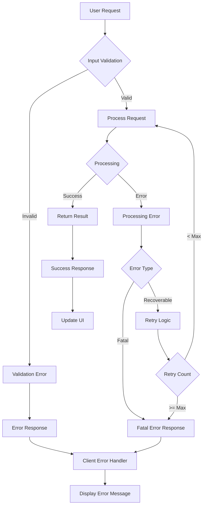
```mermaid
flowchart TD
    A[User Request] --> B{Input Validation}
    B -->|Valid| C[Process Request]
    B -->|Invalid| D[Validation Error]

    C --> E{Processing}
    E -->|Success| F[Return Result]
    E -->|Error| G[Processing Error]

    D --> H[Error Response]
    G --> I{Error Type}

    I -->|Recoverable| J[Retry Logic]
    I -->|Fatal| K[Fatal Error Response]

    J --> L{Retry Count}
    L -->|< Max| C
    L -->|>= Max| K

    F --> M[Success Response]
    H --> N[Client Error Handler]
    K --> N
    M --> O[Update UI]
    N --> P[Display Error Message]
```

### Data Validation Pipeline

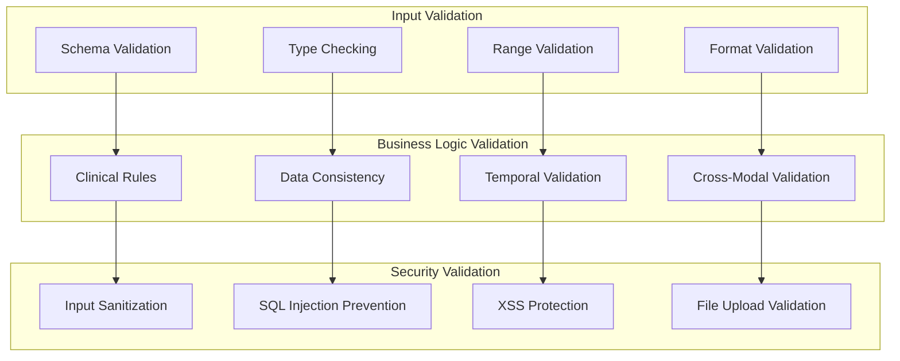
```mermaid
graph TD
    subgraph "Input Validation"
        A[Schema Validation]
        B[Type Checking]
        C[Range Validation]
        D[Format Validation]
    end

    subgraph "Business Logic Validation"
        E[Clinical Rules]
        F[Data Consistency]
        G[Temporal Validation]
        H[Cross-Modal Validation]
    end

    subgraph "Security Validation"
        I[Input Sanitization]
        J[SQL Injection Prevention]
        K[XSS Protection]
        L[File Upload Validation]
    end

    A --> E
    B --> F
    C --> G
    D --> H

    E --> I
    F --> J
    G --> K
    H --> L
```

---

## Deployment and CI/CD Pipeline

### Deployment Architecture

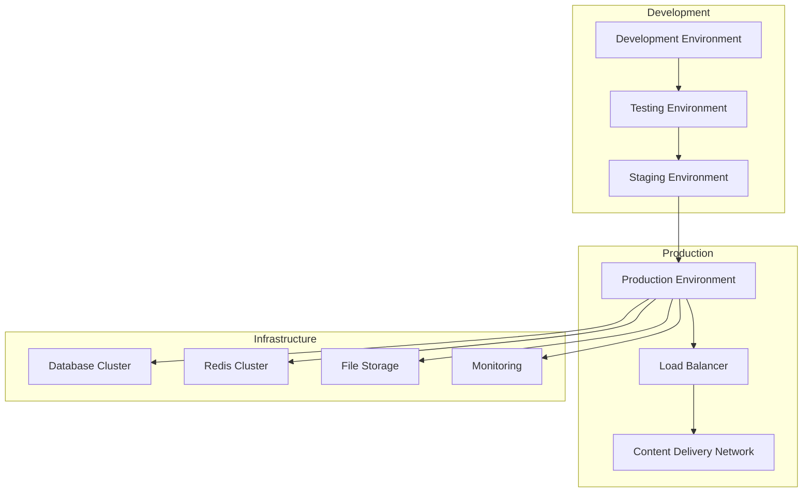
```mermaid
graph TB
    subgraph "Development"
        DEV[Development Environment]
        TEST[Testing Environment]
        STAGE[Staging Environment]
    end

    subgraph "Production"
        PROD[Production Environment]
        LB[Load Balancer]
        CDN[Content Delivery Network]
    end

    subgraph "Infrastructure"
        DB[Database Cluster]
        CACHE[Redis Cluster]
        STORAGE[File Storage]
        MONITOR[Monitoring]
    end

    DEV --> TEST
    TEST --> STAGE
    STAGE --> PROD

    PROD --> LB
    LB --> CDN

    PROD --> DB
    PROD --> CACHE
    PROD --> STORAGE
    PROD --> MONITOR
```

### CI/CD Pipeline

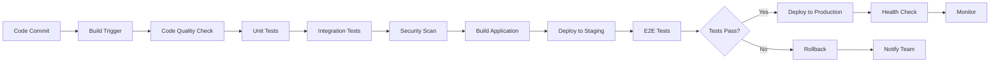
```mermaid
flowchart LR
    A[Code Commit] --> B[Build Trigger]
    B --> C[Code Quality Check]
    C --> D[Unit Tests]
    D --> E[Integration Tests]
    E --> F[Security Scan]
    F --> G[Build Application]
    G --> H[Deploy to Staging]
    H --> I[E2E Tests]
    I --> J{Tests Pass?}
    J -->|Yes| K[Deploy to Production]
    J -->|No| L[Rollback]
    K --> M[Health Check]
    M --> N[Monitor]
    L --> O[Notify Team]
```
