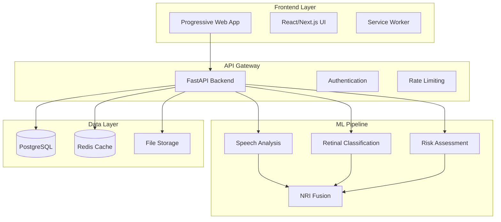

# NeuroLens-X: Technical Architecture

## ⚠️ **IMPLEMENTATION STATUS REALITY CHECK**

### **Current vs Documented Architecture**

| Component | Documented | Actual Status | Action Required |
|-----------|------------|---------------|-----------------|
| **Frontend Components** | ✅ Complete | ⚠️ Partial | Connect to working backend APIs |
| **Backend API Endpoints** | ✅ 6 endpoints | ❌ Only 1 exists | Implement 5 missing endpoints |
| **ML Model Pipeline** | ✅ 4 modalities | ❌ Interface only | Implement working ML inference |
| **Database Models** | ✅ Complete | ⚠️ Uncertain | Verify and complete models |
| **PWA Features** | ✅ Documented | ❌ Not implemented | Implement service worker |
| **Demo Data** | ✅ Planned | ❌ Missing | Generate synthetic datasets |

### **Critical Gap Analysis**
- **Functionality Gap**: System may not work end-to-end for judges
- **Demo Gap**: No test data available for judge evaluation
- **Integration Gap**: Frontend-backend connection uncertain
- **Validation Gap**: No working clinical validation metrics

---

## 🏗️ **SYSTEM ARCHITECTURE OVERVIEW**



---

## 💻 **FRONTEND ARCHITECTURE**

### **Technology Stack**
```typescript
// Core Framework
├── Next.js 14 (App Router)
├── React 18 (Concurrent Features)
├── TypeScript (Strict Mode)
├── Tailwind CSS (Design System)
└── PWA (Service Worker)

// State Management
├── Zustand (Global State)
├── React Query (Server State)
├── React Hook Form (Form State)
└── Local Storage (Persistence)

// UI Components
├── Shadcn/ui (Component Library)
├── Framer Motion (Animations)
├── Chart.js (Data Visualization)
└── React PDF (Report Generation)
```

### **Component Architecture**
```typescript
// Component Hierarchy
src/
├── app/                    # Next.js App Router
│   ├── assess/            # Assessment flow pages
│   ├── results/           # Results display pages
│   └── dashboard/         # Analytics dashboard
├── components/            # Reusable components
│   ├── ui/               # Base UI components
│   ├── forms/            # Form components
│   ├── charts/           # Visualization components
│   └── layout/           # Layout components
├── hooks/                # Custom React hooks
│   ├── useAssessment.ts  # Assessment state management
│   ├── useML.ts          # ML model interactions
│   └── useResults.ts     # Results processing
├── lib/                  # Utility libraries
│   ├── api.ts           # API client
│   ├── utils.ts         # Helper functions
│   └── validations.ts   # Form validations
└── types/               # TypeScript definitions
    ├── assessment.ts    # Assessment types
    ├── results.ts       # Results types
    └── api.ts          # API response types
```

### **PWA Configuration**
```typescript
// next.config.js
const withPWA = require('next-pwa')({
  dest: 'public',
  register: true,
  skipWaiting: true,
  runtimeCaching: [
    {
      urlPattern: /^https:\/\/api\.neurolens-x\.com\/.*/,
      handler: 'NetworkFirst',
      options: {
        cacheName: 'api-cache',
        networkTimeoutSeconds: 10,
      },
    },
    {
      urlPattern: /\.(?:png|jpg|jpeg|svg)$/,
      handler: 'CacheFirst',
      options: {
        cacheName: 'images',
        expiration: {
          maxEntries: 100,
          maxAgeSeconds: 30 * 24 * 60 * 60, // 30 days
        },
      },
    },
  ],
})
```

---

## 🔧 **BACKEND ARCHITECTURE**

### **Technology Stack**
```python
# Core Framework
├── FastAPI (Async Web Framework)
├── Pydantic (Data Validation)
├── SQLAlchemy (ORM)
├── Alembic (Database Migrations)
└── Uvicorn (ASGI Server)

# ML/Data Processing
├── scikit-learn (Classical ML)
├── XGBoost (Gradient Boosting)
├── TensorFlow/PyTorch (Deep Learning)
├── Librosa (Audio Processing)
├── OpenCV (Image Processing)
└── NumPy/Pandas (Data Manipulation)

# Infrastructure
├── PostgreSQL (Primary Database)
├── Redis (Caching & Sessions)
├── Celery (Background Tasks)
└── Docker (Containerization)
```

### **API Structure**
```python
# FastAPI Application Structure
app/
├── main.py                 # Application entry point
├── core/                   # Core configuration
│   ├── config.py          # Settings and environment
│   ├── security.py        # Authentication & authorization
│   └── database.py        # Database connection
├── api/                    # API routes
│   ├── v1/                # API version 1
│   │   ├── endpoints/     # Route handlers
│   │   │   ├── assess.py  # Assessment endpoints
│   │   │   ├── results.py # Results endpoints
│   │   │   └── models.py  # ML model endpoints
│   │   └── api.py         # API router
├── models/                 # Database models
│   ├── user.py            # User model
│   ├── assessment.py      # Assessment model
│   └── results.py         # Results model
├── schemas/                # Pydantic schemas
│   ├── assessment.py      # Assessment schemas
│   ├── results.py         # Results schemas
│   └── user.py           # User schemas
├── services/               # Business logic
│   ├── ml_service.py      # ML model service
│   ├── assessment_service.py # Assessment logic
│   └── report_service.py  # Report generation
└── ml/                     # ML pipeline
    ├── models/            # Trained models
    ├── speech/            # Speech analysis
    ├── retinal/           # Retinal classification
    ├── risk/              # Risk assessment
    └── fusion/            # NRI fusion
```

### **Database Schema**
```sql
-- Core Tables
CREATE TABLE users (
    id UUID PRIMARY KEY DEFAULT gen_random_uuid(),
    email VARCHAR(255) UNIQUE NOT NULL,
    created_at TIMESTAMP DEFAULT NOW(),
    updated_at TIMESTAMP DEFAULT NOW()
);

CREATE TABLE assessments (
    id UUID PRIMARY KEY DEFAULT gen_random_uuid(),
    user_id UUID REFERENCES users(id),
    status VARCHAR(50) DEFAULT 'pending',
    created_at TIMESTAMP DEFAULT NOW(),
    completed_at TIMESTAMP
);

CREATE TABLE assessment_results (
    id UUID PRIMARY KEY DEFAULT gen_random_uuid(),
    assessment_id UUID REFERENCES assessments(id),
    speech_score FLOAT,
    retinal_score FLOAT,
    risk_score FLOAT,
    nri_score FLOAT,
    confidence_interval JSONB,
    recommendations TEXT,
    created_at TIMESTAMP DEFAULT NOW()
);

CREATE TABLE uploaded_files (
    id UUID PRIMARY KEY DEFAULT gen_random_uuid(),
    assessment_id UUID REFERENCES assessments(id),
    file_type VARCHAR(50), -- 'audio', 'retinal'
    file_path VARCHAR(500),
    file_size INTEGER,
    uploaded_at TIMESTAMP DEFAULT NOW()
);
```

---

## 🧠 **ML PIPELINE ARCHITECTURE**

### **Model Pipeline Overview**
```python
# ML Pipeline Structure
ml_pipeline/
├── preprocessing/          # Data preprocessing
│   ├── audio_processor.py # Audio feature extraction
│   ├── image_processor.py # Image preprocessing
│   └── risk_processor.py  # Risk factor processing
├── models/                # ML models
│   ├── speech_model.py    # Speech analysis model
│   ├── retinal_model.py   # Retinal classification
│   ├── risk_model.py      # Risk assessment model
│   └── fusion_model.py    # NRI fusion model
├── inference/             # Model inference
│   ├── speech_inference.py
│   ├── retinal_inference.py
│   ├── risk_inference.py
│   └── fusion_inference.py
├── validation/            # Model validation
│   ├── metrics.py         # Performance metrics
│   ├── calibration.py     # Model calibration
│   └── fairness.py        # Bias detection
└── utils/                 # Utility functions
    ├── feature_extraction.py
    ├── uncertainty.py     # Uncertainty quantification
    └── visualization.py   # Result visualization
```

### **Speech Analysis Pipeline**
```python
# Speech Processing Architecture
class SpeechAnalyzer:
    def __init__(self):
        self.feature_extractor = AudioFeatureExtractor()
        self.model = XGBoostClassifier()
        self.uncertainty_estimator = UncertaintyQuantifier()
    
    def analyze(self, audio_file: bytes) -> SpeechResult:
        # 1. Audio preprocessing
        audio_data = self.preprocess_audio(audio_file)
        
        # 2. Feature extraction
        features = self.feature_extractor.extract(audio_data)
        
        # 3. Model inference
        prediction = self.model.predict_proba(features)
        
        # 4. Uncertainty quantification
        confidence = self.uncertainty_estimator.estimate(features, prediction)
        
        return SpeechResult(
            score=prediction[1] * 100,
            confidence_interval=confidence,
            features=features.to_dict()
        )
```

### **Retinal Classification Pipeline**
```python
# Retinal Processing Architecture
class RetinalAnalyzer:
    def __init__(self):
        self.preprocessor = ImagePreprocessor()
        self.model = CNNClassifier()
        self.vessel_analyzer = VesselAnalyzer()
    
    def analyze(self, image_file: bytes) -> RetinalResult:
        # 1. Image preprocessing
        image = self.preprocessor.process(image_file)
        
        # 2. CNN classification
        pathology_score = self.model.predict(image)
        
        # 3. Vessel analysis
        vessel_metrics = self.vessel_analyzer.analyze(image)
        
        # 4. Combined scoring
        combined_score = self.combine_scores(pathology_score, vessel_metrics)
        
        return RetinalResult(
            score=combined_score,
            pathology_probability=pathology_score,
            vessel_metrics=vessel_metrics
        )
```

### **NRI Fusion Algorithm**
```python
# Multi-Modal Fusion Architecture
class NRIFusion:
    def __init__(self):
        self.weights = {
            'speech': 0.25,
            'retinal': 0.30,
            'risk': 0.35,
            'motor': 0.10
        }
        self.uncertainty_propagator = UncertaintyPropagator()
    
    def calculate_nri(self, 
                     speech_result: SpeechResult,
                     retinal_result: RetinalResult,
                     risk_result: RiskResult) -> NRIResult:
        
        # 1. Weighted combination
        nri_score = (
            self.weights['speech'] * speech_result.score +
            self.weights['retinal'] * retinal_result.score +
            self.weights['risk'] * risk_result.score
        )
        
        # 2. Uncertainty propagation
        confidence_interval = self.uncertainty_propagator.propagate([
            speech_result.confidence_interval,
            retinal_result.confidence_interval,
            risk_result.confidence_interval
        ])
        
        # 3. Risk stratification
        risk_category = self.stratify_risk(nri_score)
        
        return NRIResult(
            nri_score=nri_score,
            risk_category=risk_category,
            confidence_interval=confidence_interval,
            recommendations=self.generate_recommendations(nri_score, risk_category)
        )
```

---

## 🔒 **SECURITY ARCHITECTURE**

### **Authentication & Authorization**
```python
# Security Configuration
SECURITY_CONFIG = {
    "JWT_SECRET_KEY": os.getenv("JWT_SECRET_KEY"),
    "JWT_ALGORITHM": "HS256",
    "ACCESS_TOKEN_EXPIRE_MINUTES": 30,
    "REFRESH_TOKEN_EXPIRE_DAYS": 7,
    "PASSWORD_MIN_LENGTH": 8,
    "RATE_LIMIT_PER_MINUTE": 60
}

# CORS Configuration
CORS_CONFIG = {
    "allow_origins": ["https://neurolens-x.com"],
    "allow_credentials": True,
    "allow_methods": ["GET", "POST", "PUT", "DELETE"],
    "allow_headers": ["*"]
}
```

### **Data Privacy & Compliance**
```python
# Privacy Configuration
PRIVACY_CONFIG = {
    "data_retention_days": 90,
    "anonymization_enabled": True,
    "encryption_at_rest": True,
    "audit_logging": True,
    "gdpr_compliance": True
}

# File Upload Security
UPLOAD_CONFIG = {
    "max_file_size": 50 * 1024 * 1024,  # 50MB
    "allowed_audio_types": [".wav", ".mp3", ".m4a"],
    "allowed_image_types": [".jpg", ".jpeg", ".png"],
    "virus_scanning": True,
    "content_validation": True
}
```

---

## 📊 **MONITORING & OBSERVABILITY**

### **Performance Monitoring**
```python
# Monitoring Configuration
MONITORING_CONFIG = {
    "metrics_collection": True,
    "performance_tracking": True,
    "error_tracking": True,
    "user_analytics": True,
    "ml_model_monitoring": True
}

# Key Performance Indicators
KPI_METRICS = {
    "response_time_p95": 500,  # milliseconds
    "error_rate_threshold": 0.01,  # 1%
    "availability_target": 0.999,  # 99.9%
    "ml_accuracy_threshold": 0.80  # 80%
}
```

### **Logging Strategy**
```python
# Logging Configuration
LOGGING_CONFIG = {
    "level": "INFO",
    "format": "%(asctime)s - %(name)s - %(levelname)s - %(message)s",
    "handlers": ["console", "file", "elasticsearch"],
    "sensitive_data_masking": True,
    "structured_logging": True
}
```

---

## 🚀 **DEPLOYMENT ARCHITECTURE**

### **Containerization**
```dockerfile
# Multi-stage Docker build
FROM node:18-alpine AS frontend-builder
WORKDIR /app
COPY package*.json ./
RUN npm ci --only=production
COPY . .
RUN npm run build

FROM python:3.11-slim AS backend
WORKDIR /app
COPY requirements.txt .
RUN pip install --no-cache-dir -r requirements.txt
COPY . .
EXPOSE 8000
CMD ["uvicorn", "main:app", "--host", "0.0.0.0", "--port", "8000"]
```

### **Infrastructure as Code**
```yaml
# Docker Compose for local development
version: '3.8'
services:
  frontend:
    build: ./frontend
    ports:
      - "3000:3000"
    environment:
      - NEXT_PUBLIC_API_URL=http://localhost:8000
  
  backend:
    build: ./backend
    ports:
      - "8000:8000"
    environment:
      - DATABASE_URL=postgresql://user:pass@db:5432/neurolens
      - REDIS_URL=redis://redis:6379
    depends_on:
      - db
      - redis
  
  db:
    image: postgres:15
    environment:
      - POSTGRES_DB=neurolens
      - POSTGRES_USER=user
      - POSTGRES_PASSWORD=pass
    volumes:
      - postgres_data:/var/lib/postgresql/data
  
  redis:
    image: redis:7-alpine
    ports:
      - "6379:6379"

volumes:
  postgres_data:
```

---

*This architecture ensures scalable, secure, and maintainable development while supporting the 50-hour hackathon timeline.*
