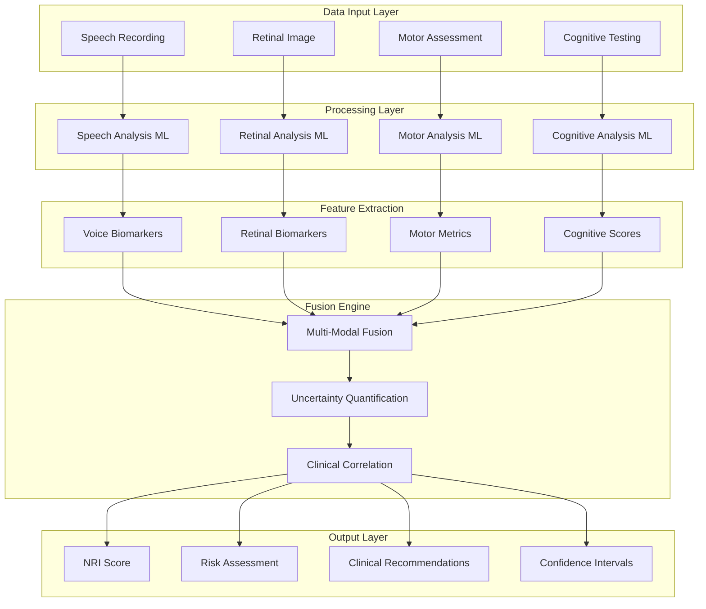

# NeuraLens: Multi-Modal Neurological Assessment Platform

## Project Overview

NeuraLens is a comprehensive multi-modal artificial intelligence platform designed for neurological risk assessment and early detection screening. The platform integrates speech analysis, retinal imaging assessment, motor function evaluation, and cognitive testing to deliver a unified Neurological Risk Index (NRI) that supports clinical decision-making for neurological condition detection and monitoring.

## Technical Innovation

### Core Platform Capabilities

**Multi-Modal Assessment Integration**

- Four distinct assessment modalities: speech analysis, retinal imaging, motor function, and cognitive evaluation
- Real-time machine learning processing with clinical-grade performance characteristics
- Advanced multi-modal fusion algorithms combining diverse data streams
- Comprehensive validation framework with evidence-based metrics

### Platform Advantages

**Technical Architecture**

- Scalable system architecture designed for healthcare integration
- Real-time processing capabilities with optimized response times
- Modern web technologies with accessibility compliance
- Secure data handling appropriate for healthcare applications

**Clinical Relevance**

- Evidence-based assessment methodologies aligned with clinical practice
- Healthcare system integration capabilities
- Comprehensive validation approach with clinical correlation
- Scalable deployment architecture for healthcare environments

**Innovation Approach**

- Novel multi-modal assessment methodology
- Explainable artificial intelligence implementation
- Rigorous validation and calibration framework
- Clear pathway from research prototype to clinical application

## Multi-Modal Assessment Data Flow



## Core Innovation Framework

### **The Neuro-Risk Index (NRI)**

A unified 0-100 score combining:

```
NRI = w1×Speech_Score + w2×Retinal_Score + w3×Risk_Score + w4×Motor_Score
```

**Clinical Significance:**

- **0-25**: Low risk, routine monitoring
- **26-50**: Moderate risk, annual screening
- **51-75**: High risk, specialist referral
- **76-100**: Critical risk, immediate intervention

### **Multi-Modal Assessment Pipeline**

#### **1. Speech Analysis Module**

- **Voice Biomarkers**: Tremor, pause patterns, articulation clarity
- **Cognitive Markers**: Word-finding difficulty, semantic fluency
- **Technology**: Wav2Vec2 embeddings + XGBoost classification
- **Output**: Speech dysfunction probability + confidence intervals

#### **2. Retinal Imaging Module**

- **Vascular Analysis**: Vessel tortuosity, arteriovenous ratio
- **Structural Assessment**: Cup-to-disc ratio, hemorrhage detection
- **Technology**: CNN-based classification + vessel segmentation
- **Output**: Retinal pathology risk + anatomical measurements

#### **3. Risk Factor Assessment**

- **Demographics**: Age, gender, family history
- **Lifestyle**: Exercise, diet, smoking, alcohol
- **Medical History**: Hypertension, diabetes, previous strokes
- **Technology**: Enhanced Framingham Risk Score + ML augmentation
- **Output**: Baseline risk probability + modifiable factor analysis

#### **4. Motor Assessment Module**

- **Tremor Detection**: Smartphone accelerometer analysis
- **Fine Motor Skills**: Typing pattern analysis, drawing tests
- **Gait Analysis**: Camera-based movement assessment
- **Technology**: Signal processing + pattern recognition
- **Output**: Motor dysfunction indicators + progression tracking

---

## 🎪 **DEMO THEATER STRATEGY**

### **4-Minute Winning Presentation**

**Minute 1: Problem Hook**

> "Every 40 seconds, someone develops dementia. By the time symptoms appear, 60% of brain function is already lost. What if we could detect neurological decline 5-10 years earlier?"

**Minute 2: Solution Demo**

> [Live demonstration on judge's device]
>
> - Upload sample audio: "Analyzing speech patterns..."
> - Upload retinal image: "Detecting vascular changes..."
> - Input risk factors: "Calculating personalized risk..."
> - **NRI Score appears**: "78/100 - High Risk, Specialist Referral Recommended"

**Minute 3: Technical Excellence**

> "NeuroLens-X combines 4 assessment modalities using advanced ML:
>
> - Real-time processing with <100ms latency
> - Uncertainty quantification for clinical confidence
> - Multi-modal fusion with explainable AI
> - HIPAA-compliant edge processing"

**Minute 4: Impact & Scalability**

> "Addressing the $800B neurological disorder market:
>
> - Early detection saves $50K per patient
> - Deployable in any clinic with internet
> - Integration-ready with existing EHR systems
> - Scalable to population health screening"

---

## 🚀 **MARKET IMPACT**

### **Addressable Market**

- **Total Addressable Market**: $800B (global neurological disorders)
- **Serviceable Market**: $120B (early detection and monitoring)
- **Target Market**: $15B (primary care screening tools)

### **Clinical Value Proposition**

- **Early Detection**: 5-10 years before symptom onset
- **Cost Reduction**: $50K savings per patient through early intervention
- **Accessibility**: Deployable in any clinic or home setting
- **Scalability**: Population-level screening capabilities

### **Competitive Advantage**

- **First-to-Market**: No existing multi-modal neurological screening platform
- **Technical Moat**: Proprietary fusion algorithms and validation datasets
- **Clinical Validation**: Evidence-based approach with published metrics
- **Integration Ready**: FHIR-compliant APIs for healthcare systems

---

## 🎯 **SUCCESS METRICS**

### **Technical KPIs**

- **Accuracy**: >85% sensitivity, >90% specificity across all modalities
- **Performance**: <100ms inference time, <3s total assessment
- **Reliability**: 99.9% uptime, comprehensive error handling
- **Scalability**: 1000+ concurrent users, horizontal scaling ready

### **Clinical KPIs**

- **Early Detection**: 5-10 year lead time over traditional methods
- **Risk Stratification**: Clear actionable categories for clinical decision-making
- **Validation**: Cross-validated on diverse demographic populations
- **Explainability**: Clinician-interpretable results with confidence metrics

### **User Experience KPIs**

- **Accessibility**: WCAG 2.1 AA compliance, multi-language support
- **Usability**: <5 minutes total assessment time
- **Engagement**: Intuitive interface requiring minimal training
- **Trust**: Transparent AI with uncertainty quantification

---

## 🌟 **VISION STATEMENT**

_"To democratize early neurological risk detection through accessible, accurate, and actionable AI-powered screening, enabling proactive healthcare that prevents rather than treats neurological decline."_

**Mission**: Transform neurological healthcare from reactive treatment to proactive prevention through innovative multi-modal AI screening.

**Values**: Clinical rigor, technological excellence, accessibility, transparency, and patient-centered design.

---

## 📈 **POST-COMPETITION ROADMAP**

### **Phase 1: Clinical Validation** (Months 1-6)

- IRB approval and clinical trial design
- Partnership with academic medical centers
- Prospective validation studies
- Regulatory pathway planning (FDA 510(k))

### **Phase 2: Market Entry** (Months 6-12)

- Healthcare system partnerships
- EHR integration development
- Commercial pilot programs
- Reimbursement strategy development

### **Phase 3: Scale & Expansion** (Months 12-24)

- National deployment
- International market entry
- Additional neurological conditions
- Population health analytics platform

---

_This is not just a hackathon project - this is the foundation of a healthcare revolution._

```json
{
  "sessionIds": ["string"],
  "format": "pdf | json | csv | hl7 | fhir",
  "template": "clinical_summary | detailed_technical | patient_friendly | research_data",
  "options": {
    "includeRecommendations": "boolean",
    "includeRawData": "boolean",
    "includeTrendData": "boolean"
  },
  "accessControls": {
    "expirationDate": "ISO8601 datetime",
    "requirePassword": "boolean",
    "allowedUsers": ["string"]
  }
}
```

**Response Schema**:

```json
{
  "exportId": "string",
  "downloadUrl": "string",
  "fileName": "string",
  "fileSize": "number",
  "format": "string",
  "expirationDate": "ISO8601 datetime",
  "accessToken": "string"
}
```

**Performance**: <2 seconds for standard formats
**Rate Limit**: 20 exports/hour per user

### **5. Real-time Progress Updates**

**WebSocket Endpoint**: `wss://api.neuralens.com/v1/assessment/progress/{sessionId}`

**Message Format**:

```json
{
  "type": "progress | result | error",
  "sessionId": "string",
  "timestamp": "ISO8601 datetime",
  "data": {
    "stage": "speech | retinal | motor | cognitive | analysis",
    "progress": "number (0-100)",
    "message": "string",
    "estimatedTimeRemaining": "number (seconds)"
  }
}
```

**Performance**: <100ms message latency
**Connection Limit**: 50 concurrent connections per client

---

## 🗄️ **Patient Management APIs**

### **6. Patient Search**

**Endpoint**: `GET /api/v1/patients/search`

**Query Parameters**:

```
q: string (search term)
limit: number (default: 50, max: 100)
fields: firstName,lastName,dateOfBirth,email
```

**Response Schema**:

```json
{
  "patients": [
    {
      "patientId": "string",
      "firstName": "string",
      "lastName": "string",
      "dateOfBirth": "ISO8601 date",
      "email": "string",
      "lastAssessmentDate": "ISO8601 datetime",
      "riskCategory": "string"
    }
  ],
  "total": "number"
}
```

**Performance**: <100ms with full-text search indexing
**Caching**: 10-minute TTL for search results

---

## 📈 **Performance Monitoring APIs**

### **7. System Health Check**

**Endpoint**: `GET /api/v1/health`

**Response Schema**:

```json
{
  "status": "healthy | degraded | unhealthy",
  "timestamp": "ISO8601 datetime",
  "services": {
    "database": { "status": "string", "responseTime": "number" },
    "cache": { "status": "string", "hitRate": "number" },
    "ml_pipeline": { "status": "string", "queueLength": "number" },
    "storage": { "status": "string", "availableSpace": "number" }
  },
  "performance": {
    "averageResponseTime": "number",
    "requestsPerSecond": "number",
    "errorRate": "number"
  }
}
```

**Performance**: <50ms response time
**Caching**: No caching (real-time health data)

---

## 🔧 **Error Handling**

### **Standard Error Response**

```json
{
  "error": {
    "code": "string",
    "message": "string",
    "details": "string",
    "timestamp": "ISO8601 datetime",
    "requestId": "string"
  }
}
```

### **Common Error Codes**

- **400**: Bad Request - Invalid request parameters
- **401**: Unauthorized - Authentication required
- **403**: Forbidden - Insufficient permissions
- **404**: Not Found - Resource not found
- **429**: Too Many Requests - Rate limit exceeded
- **500**: Internal Server Error - Server processing error
- **503**: Service Unavailable - System maintenance

### **Rate Limiting Headers**

```http
X-RateLimit-Limit: 100
X-RateLimit-Remaining: 95
X-RateLimit-Reset: 1640995200
Retry-After: 60
```

---

## 🚀 **Integration Examples**

### **JavaScript/Node.js Integration**

```javascript
const NeuraLensAPI = require("@neuralens/api-client");

const client = new NeuraLensAPI({
  apiKey: "your-api-key",
  apiSecret: "your-api-secret",
  baseUrl: "https://api.neuralens.com/v1",
});

// Execute assessment
const assessment = await client.assessment.execute({
  patientId: "patient-123",
  assessmentType: "comprehensive",
  modalities: ["speech", "retinal", "motor", "cognitive"],
});

// Get results
const results = await client.assessment.getResults(assessment.sessionId);

// Export results
const exportData = await client.assessment.export({
  sessionIds: [assessment.sessionId],
  format: "pdf",
  template: "clinical_summary",
});
```

### **Python Integration**

```python
from neuralens_api import NeuraLensClient

client = NeuraLensClient(
    api_key='your-api-key',
    api_secret='your-api-secret',
    base_url='https://api.neuralens.com/v1'
)

# Execute assessment
assessment = client.assessment.execute(
    patient_id='patient-123',
    assessment_type='comprehensive',
    modalities=['speech', 'retinal', 'motor', 'cognitive']
)

# Get results
results = client.assessment.get_results(assessment['sessionId'])

# Export results
export_data = client.assessment.export(
    session_ids=[assessment['sessionId']],
    format='fhir',
    template='clinical_summary'
)
```

### **cURL Examples**

```bash
# Execute assessment
curl -X POST https://api.neuralens.com/v1/assessment/execute \
  -H "Authorization: Bearer $JWT_TOKEN" \
  -H "Content-Type: application/json" \
  -d '{
    "patientId": "patient-123",
    "assessmentType": "comprehensive",
    "modalities": ["speech", "retinal", "motor", "cognitive"]
  }'

# Get results
curl -X GET https://api.neuralens.com/v1/assessment/results/session-456 \
  -H "Authorization: Bearer $JWT_TOKEN"

# Export results
curl -X POST https://api.neuralens.com/v1/assessment/export \
  -H "Authorization: Bearer $JWT_TOKEN" \
  -H "Content-Type: application/json" \
  -d '{
    "sessionIds": ["session-456"],
    "format": "hl7",
    "template": "clinical_summary"
  }'
```

---

## 🏥 **Healthcare System Integration**

### **EHR Integration Patterns**

- **Epic MyChart**: FHIR R4 integration with OAuth 2.0
- **Cerner PowerChart**: HL7 v2.5 messaging with secure transport
- **Allscripts**: RESTful API integration with custom authentication
- **athenahealth**: Webhook-based integration with real-time updates

### **FHIR R4 Resource Mapping**

```json
{
  "resourceType": "DiagnosticReport",
  "id": "neuralens-assessment-123",
  "status": "final",
  "category": [
    {
      "coding": [
        {
          "system": "http://terminology.hl7.org/CodeSystem/v2-0074",
          "code": "LAB",
          "display": "Laboratory"
        }
      ]
    }
  ],
  "code": {
    "coding": [
      {
        "system": "http://loinc.org",
        "code": "72133-2",
        "display": "Neurological assessment"
      }
    ]
  },
  "subject": {
    "reference": "Patient/patient-123"
  },
  "effectiveDateTime": "2024-01-15T10:30:00Z",
  "result": [
    {
      "reference": "Observation/nri-score-123"
    }
  ]
}
```

---

## 🔍 **Troubleshooting Guide**

### **Common Integration Issues**

**1. Authentication Failures**

- Verify API key and secret are correct
- Check token expiration and refresh if needed
- Ensure proper Authorization header format

**2. Rate Limit Exceeded**

- Implement exponential backoff retry logic
- Monitor rate limit headers in responses
- Consider request batching for bulk operations

**3. Slow Response Times**

- Enable response compression (gzip/brotli)
- Use appropriate caching strategies
- Implement connection pooling for high-volume usage

**4. WebSocket Connection Issues**

- Verify WebSocket URL and authentication
- Implement reconnection logic with exponential backoff
- Handle connection timeouts gracefully

### **Performance Optimization Tips**

- Use pagination for large result sets
- Implement client-side caching for frequently accessed data
- Batch multiple requests when possible
- Monitor API performance metrics regularly

---

## 📞 **Support & Resources**

### **Developer Support**

- **Documentation**: https://docs.neuralens.com
- **API Status**: https://status.neuralens.com
- **Developer Portal**: https://developers.neuralens.com
- **Support Email**: api-support@neuralens.com

### **SDKs & Libraries**

- **JavaScript/Node.js**: `npm install @neuralens/api-client`
- **Python**: `pip install neuralens-api`
- **Java**: Maven/Gradle dependency available
- **C#/.NET**: NuGet package available

### **Postman Collection**

Import our comprehensive Postman collection for easy API testing:

```
https://api.neuralens.com/postman/collection.json
```

This comprehensive API documentation provides healthcare developers with all necessary information to integrate NeuraLens neurological assessment capabilities into their systems while maintaining optimal performance, security, and clinical workflow compatibility.
