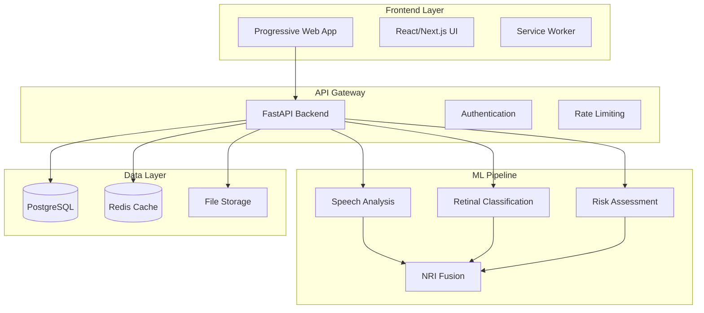

# NeuroLens-X: Technical Architecture

## ⚠️ **IMPLEMENTATION STATUS REALITY CHECK**

### **Current vs Documented Architecture**

| Component | Documented | Actual Status | Action Required |
|-----------|------------|---------------|-----------------|
| **Frontend Components** | ✅ Complete | ⚠️ Partial | Connect to working backend APIs |
| **Backend API Endpoints** | ✅ 6 endpoints | ❌ Only 1 exists | Implement 5 missing endpoints |
| **ML Model Pipeline** | ✅ 4 modalities | ❌ Interface only | Implement working ML inference |
| **Database Models** | ✅ Complete | ⚠️ Uncertain | Verify and complete models |
| **PWA Features** | ✅ Documented | ❌ Not implemented | Implement service worker |
| **Demo Data** | ✅ Planned | ❌ Missing | Generate synthetic datasets |

### **Critical Gap Analysis**
- **Functionality Gap**: System may not work end-to-end for judges
- **Demo Gap**: No test data available for judge evaluation
- **Integration Gap**: Frontend-backend connection uncertain
- **Validation Gap**: No working clinical validation metrics

---

## 🏗️ **SYSTEM ARCHITECTURE OVERVIEW**



---

## 💻 **FRONTEND ARCHITECTURE**

### **Technology Stack**
```typescript
// Core Framework
├── Next.js 14 (App Router)
├── React 18 (Concurrent Features)
├── TypeScript (Strict Mode)
├── Tailwind CSS (Design System)
└── PWA (Service Worker)

// State Management
├── Zustand (Global State)
├── React Query (Server State)
├── React Hook Form (Form State)
└── Local Storage (Persistence)

// UI Components
├── Shadcn/ui (Component Library)
├── Framer Motion (Animations)
├── Chart.js (Data Visualization)
└── React PDF (Report Generation)
```

### **Component Architecture**
```typescript
// Component Hierarchy
src/
├── app/                    # Next.js App Router
│   ├── assess/            # Assessment flow pages
│   ├── results/           # Results display pages
│   └── dashboard/         # Analytics dashboard
├── components/            # Reusable components
│   ├── ui/               # Base UI components
│   ├── forms/            # Form components
│   ├── charts/           # Visualization components
│   └── layout/           # Layout components
├── hooks/                # Custom React hooks
│   ├── useAssessment.ts  # Assessment state management
│   ├── useML.ts          # ML model interactions
│   └── useResults.ts     # Results processing
├── lib/                  # Utility libraries
│   ├── api.ts           # API client
│   ├── utils.ts         # Helper functions
│   └── validations.ts   # Form validations
└── types/               # TypeScript definitions
    ├── assessment.ts    # Assessment types
    ├── results.ts       # Results types
    └── api.ts          # API response types
```

### **PWA Configuration**
```typescript
// next.config.js
const withPWA = require('next-pwa')({
  dest: 'public',
  register: true,
  skipWaiting: true,
  runtimeCaching: [
    {
      urlPattern: /^https:\/\/api\.neurolens-x\.com\/.*/,
      handler: 'NetworkFirst',
      options: {
        cacheName: 'api-cache',
        networkTimeoutSeconds: 10,
      },
    },
    {
      urlPattern: /\.(?:png|jpg|jpeg|svg)$/,
      handler: 'CacheFirst',
      options: {
        cacheName: 'images',
        expiration: {
          maxEntries: 100,
          maxAgeSeconds: 30 * 24 * 60 * 60, // 30 days
        },
      },
    },
  ],
})
```

---

## 🔧 **BACKEND ARCHITECTURE**

### **Technology Stack**
```python
# Core Framework
├── FastAPI (Async Web Framework)
├── Pydantic (Data Validation)
├── SQLAlchemy (ORM)
├── Alembic (Database Migrations)
└── Uvicorn (ASGI Server)

# ML/Data Processing
├── scikit-learn (Classical ML)
├── XGBoost (Gradient Boosting)
├── TensorFlow/PyTorch (Deep Learning)
├── Librosa (Audio Processing)
├── OpenCV (Image Processing)
└── NumPy/Pandas (Data Manipulation)

# Infrastructure
├── PostgreSQL (Primary Database)
├── Redis (Caching & Sessions)
├── Celery (Background Tasks)
└── Docker (Containerization)
```

### **API Structure**
```python
# FastAPI Application Structure
app/
├── main.py                 # Application entry point
├── core/                   # Core configuration
│   ├── config.py          # Settings and environment
│   ├── security.py        # Authentication & authorization
│   └── database.py        # Database connection
├── api/                    # API routes
│   ├── v1/                # API version 1
│   │   ├── endpoints/     # Route handlers
│   │   │   ├── assess.py  # Assessment endpoints
│   │   │   ├── results.py # Results endpoints
│   │   │   └── models.py  # ML model endpoints
│   │   └── api.py         # API router
├── models/                 # Database models
│   ├── user.py            # User model
│   ├── assessment.py      # Assessment model
│   └── results.py         # Results model
├── schemas/                # Pydantic schemas
│   ├── assessment.py      # Assessment schemas
│   ├── results.py         # Results schemas
│   └── user.py           # User schemas
├── services/               # Business logic
│   ├── ml_service.py      # ML model service
│   ├── assessment_service.py # Assessment logic
│   └── report_service.py  # Report generation
└── ml/                     # ML pipeline
    ├── models/            # Trained models
    ├── speech/            # Speech analysis
    ├── retinal/           # Retinal classification
    ├── risk/              # Risk assessment
    └── fusion/            # NRI fusion
```

### **Database Schema**
```sql
-- Core Tables
CREATE TABLE users (
    id UUID PRIMARY KEY DEFAULT gen_random_uuid(),
    email VARCHAR(255) UNIQUE NOT NULL,
    created_at TIMESTAMP DEFAULT NOW(),
    updated_at TIMESTAMP DEFAULT NOW()
);

CREATE TABLE assessments (
    id UUID PRIMARY KEY DEFAULT gen_random_uuid(),
    user_id UUID REFERENCES users(id),
    status VARCHAR(50) DEFAULT 'pending',
    created_at TIMESTAMP DEFAULT NOW(),
    completed_at TIMESTAMP
);

CREATE TABLE assessment_results (
    id UUID PRIMARY KEY DEFAULT gen_random_uuid(),
    assessment_id UUID REFERENCES assessments(id),
    speech_score FLOAT,
    retinal_score FLOAT,
    risk_score FLOAT,
    nri_score FLOAT,
    confidence_interval JSONB,
    recommendations TEXT,
    created_at TIMESTAMP DEFAULT NOW()
);

CREATE TABLE uploaded_files (
    id UUID PRIMARY KEY DEFAULT gen_random_uuid(),
