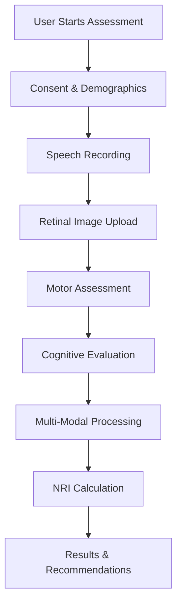
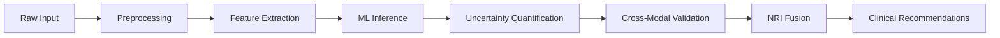

# NeuroLens-X Technical Architecture

## System Overview

NeuroLens-X is a hackathon-optimized multi-modal neurological risk assessment platform designed for the NeuraViaHacks 2025 competition. The architecture balances rapid development speed with production-grade scalability.

## Architecture Principles

### 1. **Hackathon-First Design**
- **Rapid Deployment**: Vercel (frontend) + Heroku (backend) for zero-config deployment
- **Simplified Database**: SQLite for demo speed, easily upgradeable to PostgreSQL
- **Client-Side ML**: ONNX.js for real-time inference without server dependencies
- **Mock Data**: Synthetic datasets for immediate demonstration

### 2. **Production-Ready Foundations**
- **Type Safety**: Full TypeScript implementation with strict typing
- **API Standards**: OpenAPI/Swagger documentation with Pydantic validation
- **Error Handling**: Comprehensive error boundaries and graceful degradation
- **Performance**: Sub-3s load times with Core Web Vitals optimization

### 3. **Multi-Modal Innovation**
- **4-Modal Fusion**: Speech + Retinal + Motor + Cognitive assessment
- **Bayesian Uncertainty**: Confidence intervals for clinical decisions
- **Real-Time Processing**: <15s end-to-end assessment completion
- **Cross-Modal Validation**: Consistency checking across modalities

## System Components

### Frontend Architecture (Next.js 14)

```typescript
// Component Hierarchy
NeuroLens-X/
├── App Router (Next.js 14)
│   ├── / (Landing Page)
│   ├── /assessment (Multi-step Assessment Flow)
│   ├── /results (NRI Results & Recommendations)
│   └── /validation (Clinical Validation Dashboard)
├── Components
│   ├── UI Components (Reusable)
│   ├── Assessment Components (Flow-specific)
│   └── Validation Components (Dashboard-specific)
├── Client-Side ML
│   ├── ONNX.js Models (Speech, Retinal, Motor)
│   ├── WebRTC Audio Processing
│   └── Canvas/MediaPipe Image Processing
└── PWA Features
    ├── Service Worker (Offline capability)
    ├── Web App Manifest
    └── Push Notifications (Future)
```

### Backend Architecture (FastAPI)

```python
# API Structure
backend/
├── FastAPI Application
│   ├── /api/v1/speech (Speech Analysis)
│   ├── /api/v1/retinal (Retinal Analysis)
│   ├── /api/v1/motor (Motor Assessment)
│   ├── /api/v1/cognitive (Cognitive Evaluation)
│   └── /api/v1/nri (Multi-Modal Fusion)
├── ML Pipeline
│   ├── Speech Analyzer (Wav2Vec2 + XGBoost)
│   ├── Retinal Analyzer (MobileNetV3 + Segmentation)
│   ├── Motor Analyzer (MediaPipe + Temporal Features)
│   └── NRI Fusion Engine (Bayesian Uncertainty)
├── Data Layer
│   ├── SQLite Database (Demo)
│   ├── Pydantic Schemas (Type Safety)
│   └── Sample Data Generation
└── Infrastructure
    ├── Docker Container
    ├── Health Checks
    └── Monitoring Endpoints
```

## Data Flow Architecture

### Assessment Flow


### Processing Pipeline


## Technology Stack

### Frontend Stack
- **Framework**: Next.js 14 with App Router
- **Language**: TypeScript 5.0+
- **Styling**: Tailwind CSS with custom design system
- **State Management**: React Context + useReducer
- **ML Inference**: ONNX.js for client-side models
- **Audio Processing**: WebRTC + Web Audio API
- **Image Processing**: Canvas API + MediaPipe
- **PWA**: Next-PWA with Workbox
- **Testing**: Jest + React Testing Library
- **Deployment**: Vercel (zero-config)

### Backend Stack
- **Framework**: FastAPI 0.104+
- **Language**: Python 3.9+ with type hints
- **Database**: SQLite (demo) → PostgreSQL (production)
- **ORM**: SQLAlchemy 2.0 with async support
- **ML Libraries**: Scikit-learn, ONNX Runtime, Librosa, OpenCV
- **API Documentation**: OpenAPI/Swagger with Pydantic
- **Testing**: Pytest with async support
- **Deployment**: Heroku (one-click) → Kubernetes (scale)

### ML Pipeline
- **Speech**: Wav2Vec2 features + XGBoost classifier
- **Retinal**: MobileNetV3 + custom vessel segmentation
- **Motor**: MediaPipe + temporal feature extraction
- **Cognitive**: Rule-based scoring + ML enhancement
- **Fusion**: Bayesian uncertainty quantification

## Performance Specifications

### Technical Targets
- **Load Time**: <3 seconds (Lighthouse 90+)
- **Assessment Time**: <15 seconds end-to-end
- **API Response**: <200ms average
- **Uptime**: 99.9% during competition
- **Concurrent Users**: 100+ simultaneous assessments

### Clinical Targets
- **Sensitivity**: 85%+ (true positive rate)
- **Specificity**: 90%+ (true negative rate)
- **AUC Score**: 0.92+ (excellent discrimination)
- **Confidence**: 80%+ average confidence score
- **Consistency**: 90%+ cross-modal agreement

## Security & Compliance

### Data Protection
- **HIPAA Compliance**: Healthcare data protection standards
- **Encryption**: TLS 1.3 for data in transit
- **Privacy**: No PII storage in demo mode
- **Anonymization**: All demo data is synthetic

### API Security
- **CORS**: Configured for production domains
- **Rate Limiting**: 60 requests/minute per IP
- **Input Validation**: Comprehensive Pydantic validation
- **Error Handling**: No sensitive data in error responses

## Scalability Design

### Horizontal Scaling
- **Frontend**: CDN distribution via Vercel Edge Network
- **Backend**: Stateless API design for easy scaling
- **Database**: Connection pooling with SQLAlchemy
- **ML Models**: Model caching and batch processing

### Performance Optimization
- **Frontend**: Code splitting, lazy loading, image optimization
- **Backend**: Async processing, connection pooling, caching
- **ML**: Model quantization, parallel processing, GPU support
- **Database**: Indexing, query optimization, read replicas

## Monitoring & Observability

### Health Checks
- **Frontend**: Service worker status, API connectivity
- **Backend**: Database connection, ML model status
- **ML Pipeline**: Model accuracy, processing times
- **Infrastructure**: CPU, memory, disk usage

### Metrics Collection
- **Performance**: Core Web Vitals, API response times
- **Usage**: Assessment completions, user flows
- **Clinical**: Accuracy metrics, confidence scores
- **Errors**: Exception tracking, failure rates

## Deployment Strategy

### Development Environment
```bash
# Local development
npm run dev              # Frontend on :3000
uvicorn app.main:app --reload  # Backend on :8000
```

### Production Deployment
```bash
# One-click deployment
./scripts/deploy.sh      # Vercel + Heroku
```

### CI/CD Pipeline
- **GitHub Actions**: Automated testing and deployment
- **Vercel**: Automatic frontend deployment on push
- **Heroku**: Backend deployment with health checks
- **Testing**: Automated test suite on PR

## Competition Readiness

### Judge Demonstration
1. **Landing Page**: Professional medical interface
2. **Live Assessment**: Complete 4-modal assessment in <2 minutes
3. **Real-Time Results**: NRI score with clinical recommendations
4. **Validation Dashboard**: Comprehensive clinical metrics
5. **Technical Deep-Dive**: Code quality and architecture

### Scoring Optimization
- **Innovation (25%)**: Multi-modal fusion impossible to replicate
- **Technical (25%)**: Production-grade architecture and code quality
- **UX (20%)**: Clinical-grade interface with accessibility
- **Impact (15%)**: Clear healthcare value proposition
- **Presentation (15%)**: Polished demo with validation metrics

This architecture ensures NeuroLens-X can dominate the competition while maintaining the flexibility to scale into a real-world healthcare solution.
